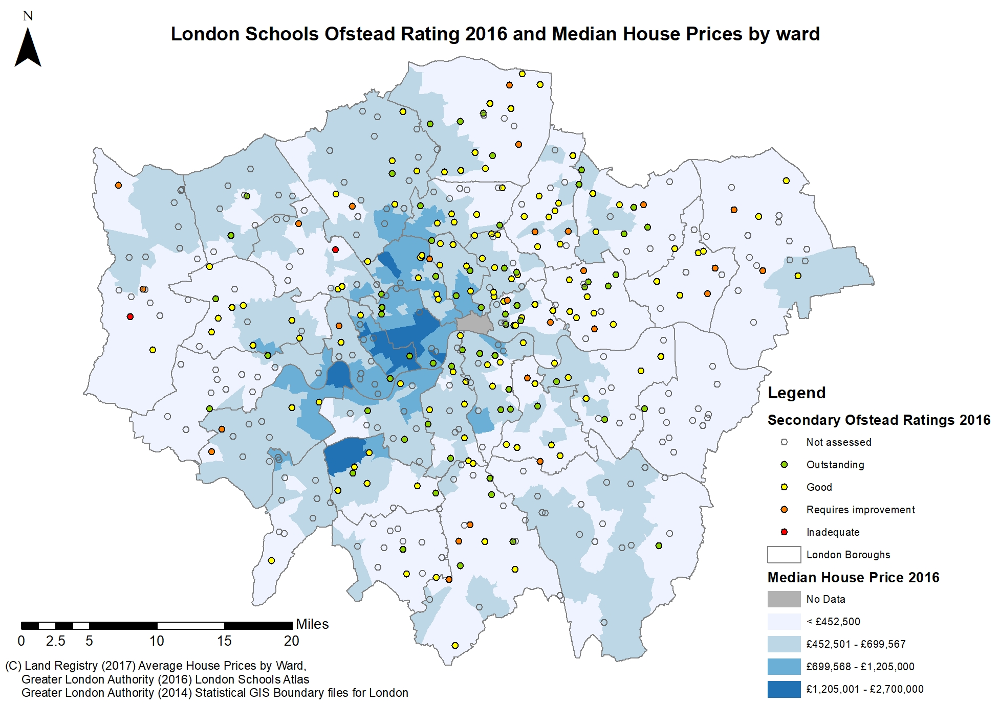
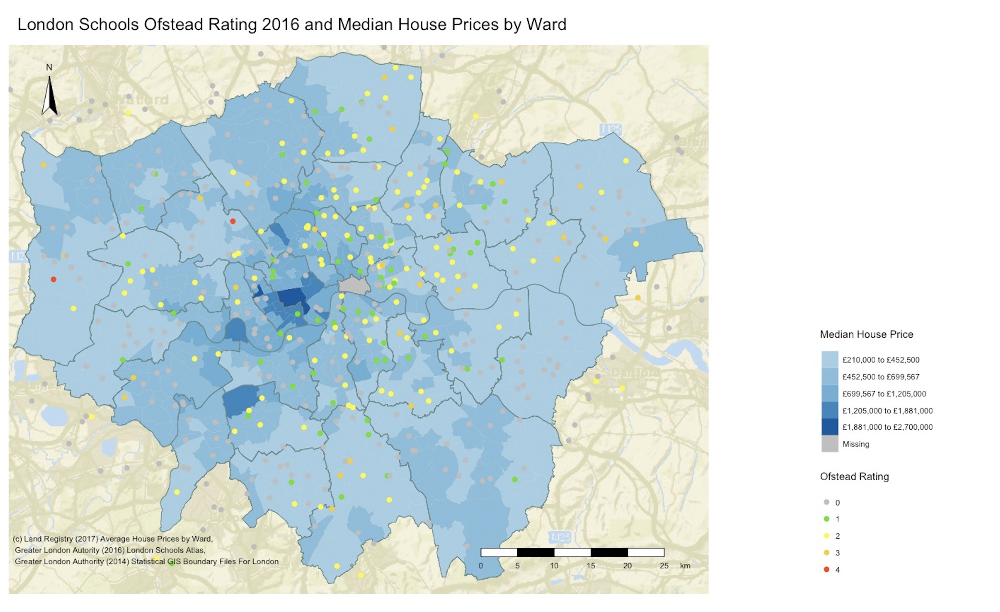

It is often thought that affluent neighbourhoods contain higher-ranking schools (Deluca and Rosenblatt, 2010). Two maps have been produced outlining Median House price by ward and Secondary School Ofsted ratings for London.  

###### Figure 1 Map created using ArcGIS:
  

###### Figure 2 Map created using R:


## Assessment of Data Sources  
*House Prices by ward*  
House prices per ward were used for the choropleth map. Data was available from 1995-2017, however the year of 2016 was chosen as it matched other datasets being used. Data included the Mean and Median House price per ward based on the houses sold that year. The Median house price was selected, a key limitation of the dataset is both the mean and the median would be affected by the number and type of properties that were sold.     
*Ward Boundaries*  
Wards were chosen as the geographical breakdown to display the data as both MSOA’s and LOAS’s were too disaggregate given the scale of the map. However, it is recognised that wards are the spatial unit used for electoral purposes and therefore the boundaries frequently change. For this analysis Ward boundaries for the year (INSERT) were chosen.    
*Schools Data*   
The London schools Atlas shapefile provided point data for all London schools and there relative Ofsted rating. Although all the schools within London are plotted Ofsted scores are only present for a proportion as Ofsted is undertaken an average of every four years per school (gov.uk, 2018). 

## Comparison of work flow    
When comparing the workflow used to create the two maps there are some key differences. 
Figure 2: 


ArcGIS requires more steps to set up the working environment and prepare the data sources for use. For ArcGIS initial data manipulation had to be undertaken in Excel this included the removal of unusable characters and selecting the relevant year of data. Whereas, in R the data was cleaned and manipulated using the tidyverse package, an example being the use of Grep to select the correct year of data. R allows for greater transparency of data cleaning and manipulation, which is key for reproducible research. 

```{r eval=FALSE}
library(tmap)
library(tmaptools)
library(OpenStreetMap)
library(tidyverse)
library(rgeos)

# Read in CSV Data 
HousePriceData<- read.csv("Assessment_1/Data/land-registry-house-prices-ward.csv")
#Check what it has been imported as
class(HousePriceData)
# check the types of coloums to see import errors
datatypelist <- data.frame(cbind(lapply(HousePriceData,class)))

# Import Shapefile from Folder location
WardMapSF <- read_shape("Assessment_1/Wards_Shapefile/London-wards-2014_ESRI/London_Ward_CityMerged.shp", as.sf = TRUE)
SchoolsData <- read_shape("Assessment_1/Schools_Shapefile/All_Schools_shp/school_data_london_Atlas_2016.shp", as.sf = TRUE)
Boroughs <- read_shape("Assessment_1/BoundaryData/england_lad_2011.shp", as.sf = TRUE)

#Plot to Check Import
qtm(WardMapSF) 
qtm(SchoolsData)
qtm(Boroughs)

# Set up Schools shapefile to Extract only Secondary schools
SchoolsDataSP <- as(SchoolsData, "Spatial")
Secondary <- SchoolsDataSP[grep("^Sec",SchoolsDataSP@data$PHASE),]

#Attept to grab only schools with Ofstead Rating
#Secondary_Ofstead <- Secondary[grep(1|2|3|4,Secondary@data$PHASE),]

#Plot just secondary schools to check results
qtm(Secondary)

# Clean House Price Data - to get 2016 only
HousePriceYear <- HousePriceData[grep("Year ending Dec 2016",HousePriceData[,4]),]
HousePriceClean <- HousePriceYear[grep("Median",HousePriceYear[,5]),]
HousePriceClean[,'Value'] <- as.numeric(as.character(HousePriceClean[,'Value']))

# Join HousePrice Data to Ward Shapfile
WardDataMap <- append_data(WardMapSF,HousePriceClean, key.shp = "GSS_CODE", key.data = "Code", ignore.duplicates = TRUE)
```

ArcGIS gives the user greater control of the final output. In R the plot drawn by the studio is only indicative and therefore not representative of what it looks like when exported.

```{r eval=FALSE}
#load Background
london_osm <- read_osm(WardDataMap, type = "esri", zoom = NULL)

Mypal <- c('grey','#59E110','#F9FF33','#F4D01F','#FF430C')
#produce plots
qtm(london_osm) +
tm_shape(WardDataMap) + 
  tm_polygons("Value", 
              lwd=0,
              style="jenks",
              palette="Blues",
              legend.format=list(fun=function(x) paste0("£",formatC(x, digits=0, format="f",big.mark = ","))),
              midpoint=NA,
              title="Median House Price") + 
  tm_compass(position = c("left", "top"),type = "arrow") + 
  tm_scale_bar(position = c("right", "bottom"),size=0.7) +
  tm_layout(frame=FALSE,main.title="London Schools Ofstead Rating 2016 and Median House Prices by Ward",legend.outside=TRUE, legend.position =c("right", "bottom"))+
  tm_shape(Boroughs)+
  tm_borders(col = "paleturquoise4")+
  tm_shape(Secondary)+
  tm_dots(col="ofsted", size = 0.3, palette=Mypal, title="Ofstead Rating")+
  tm_credits("(c) Land Registry (2017) Average House Prices by Ward,\n Greater London Autority (2016) London Schools Atlas,\n Greater London Authority (2014) Statistical GIS Boundary Files For London", position=c("LEFT", "bottom"), size = 0.7)
```


## Critical evaluation    
Overall, the map produced through ArcGIS is more visually appealing. School boundaries are clearly defined through the outline and the symbology of the ‘Not assessed Schools’ makes them more subdued compared to schools where Ofstead data is available. The ability to make the tm_dots transparent for one class was not achieved, although a colour was chosen to match the colour of missing data in both layers the dots of grey throughout the map are distracting.

Colour and implied meaning is key for mapping when the colour can dominate the message. Traffic light colours (Green to Red) were used to show the Ofsted rating of schools to draw their attention to the failing schools.

Class intervals were set to 5, as Heywood et al. (2005) discussed that having more can lead to confusion. Jenks was chosen as the classification for the Housing data. Class interval selection is widely discussed throughout literature, as different class intervals can alter the overall message of the map (Andrienko, et al, 2006). This classification was chosen on the bases that it seeks to reduce variance within the data classes (Reference). 

Mapping the median house price could be viewed as misleading as it is visualised as a spatially extensive variable, whereby the value of the area only holds true for that area (Longley et al,2011). Upon reflection, it would have been better to visualize it in a spatially intensive format I.e. proportion or ratio.

