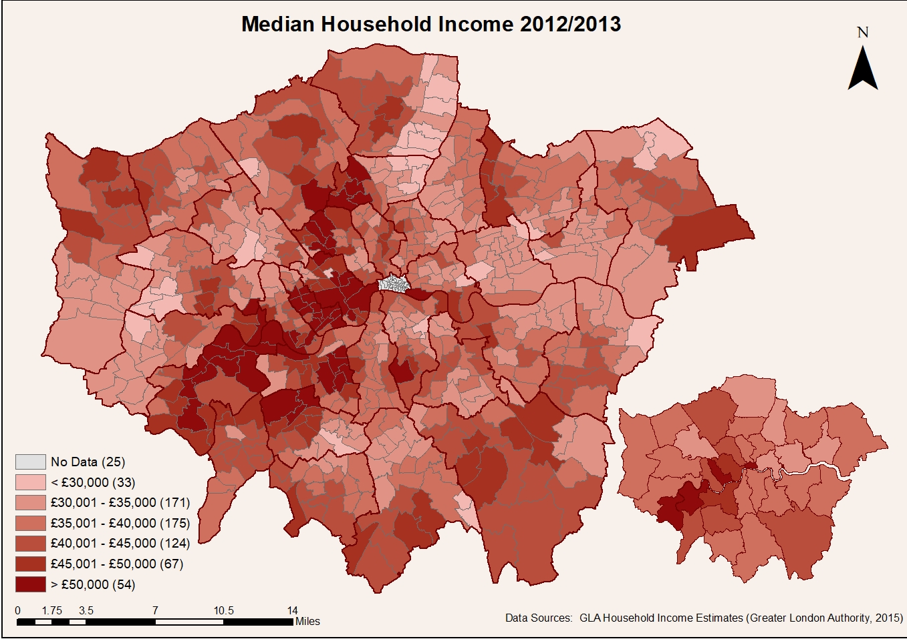

Choropleth maps of Household income estimates have been produced using ArcGIS and R. A choropleth style was chosen as the most appropriate mapping technique as it allows for the areas to be shaded proportional to the measurement of the statistical variable being analysed.

Figure 1: 

# Assessment of Data Sources

The data selected for mapping with the Household income data available Produced by the Greater London Authority. The data itself covered yearly values for a period of 10 years from 2001-2013. 
Interestingly, the data was available for both the mean and median for each spatial resolution. The mean (sum of all the total house hold incomes/ total observations) and the median (middle value of the observations per area) can portray very different results and introduce uncertainty in to the map. As the raw data is not available, processes such as the removal outliers cannot be guaranteed. Furthermore, the data used is estimates not observations, producing uncertainty in the map, as the outcome is dependent on the variables taken in to consideration.

It could be argued that the use of household estimate data here is misleading as it has not been converted to a spatially intensive form, i.e. a density, ratio or proportion but have been displayed as a spatially extensive variable where the value of the area is only true for those areas (Longley et al. 2011).
